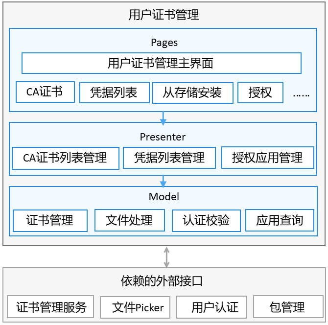

# 用户证书管理

## 简介<a name="section11660541593"></a>

用户证书管理是OpenHarmony中预置的系统应用，主要的功能包含系统根证书查看与启用禁用，用户根证书的安装、查看、启用禁用与卸载，公共业务证书的安装、查看、授权管理与卸载，私有业务证书的查看等功能。
应用架构如图1所示。

图1 用户证书管理架构图




## 目录<a name="section161941989596"></a>

```
├── AppScope								# 应用配置
└── certmanager
    └── src
        └── main
            ├── ets							# 代码目录
            │   ├── Application				# AbilityStage类实现
            │   ├── MainAbility				# Ability类实现
            │   ├── model					# model层功能类实现
            │   ├── pages					# 页面展示实现
            │   ├── presenter				# 页面presenter层功能类实现
            └── resources					# 资源文件目录
```

## 说明<a name="section1312121216216"></a>

### 使用说明<a name="section1551164914237"></a>

三方应用拉起用户证书管理应用并执行申请应用授权，使用方法如下：

```
//拉起应用申请应用授权
globalThis.context.startAbilityForResult(
{
    bundleName: "com.ohos.certmanager",
    abilityName: "MainAbility",
    uri: "requestAuthorize",
    parameters: {
    	appUid: appUid,		//传入申请应用的appUid
    }
})
.then((data) => {
	if (!data.resultCode) {
    	this.authUri = data.want.parameters.authUri;	//授权成功后获取返回的authUri
    }
})
```

## 相关仓<a name="section1371113476307"></a>

**security_certificate_manager**
